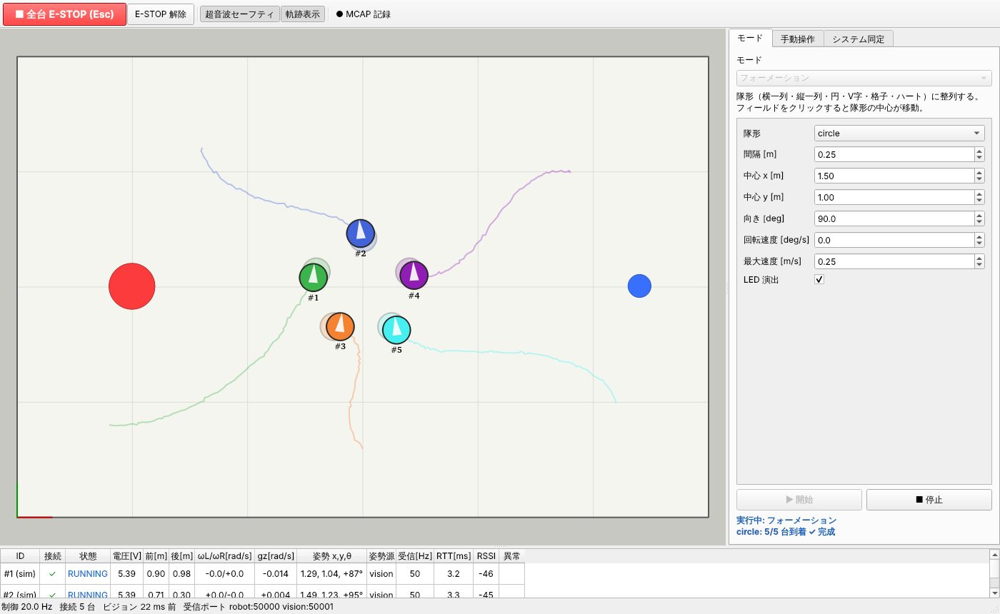
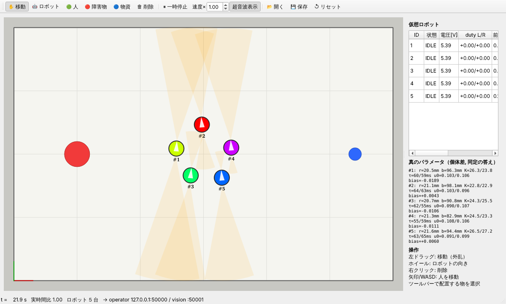
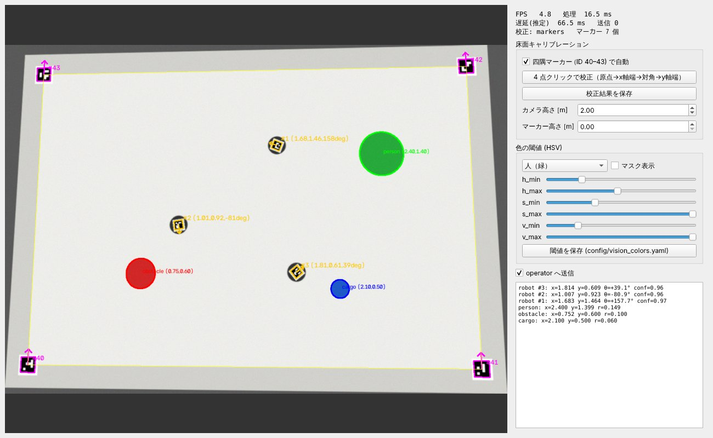
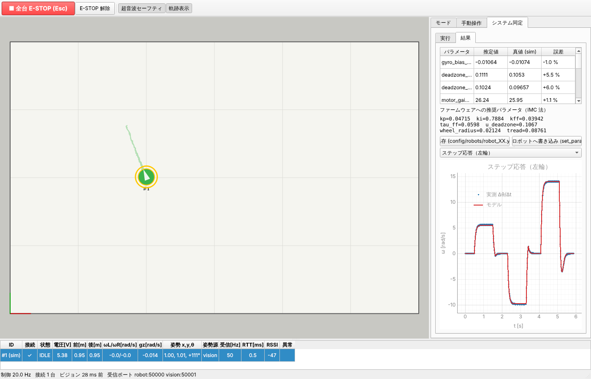

# COCO-LINK

**避難所・介護施設で、複数台のロボットが協調するパフォーマンスで人々を楽しませ、心のケアをしながら物資の運搬も担う
実用型パフォーマンスロボットシステム**（大学「ロボット創造実験」）



## 特徴

- **シミュレータと実機で同じインターフェース**: シミュレータは「仮想 ESP32 × N 台」と「仮想ビジョン」を
  実機と同じ UDP プロトコルで演じる。上位制御はどちらが相手か区別せず、シミュレータで作ったものがそのまま実機で動く
- **ワンボタンのシステム同定**: 不感帯・モータゲイン/時定数・車輪半径・トレッド幅・ジャイロバイアスを推定し、
  IMC 法で速度制御ゲインを設計してロボットへ書き込む。シミュレータのロボットは **隠れた個体差（真値）** を持ち、推定精度を検証できる
- **拡張できるモード**: `pc/src/coco_link/modes/` に 1 ファイル置くだけで GUI に出る。初期実装はフォーメーション
  （円・V 字・ハートなど、ハンガリアン法でスロット割当）と、人の後ろに隊列を作る追従（軌跡追従 + Pure Pursuit）
- **ArUco + 色によるビジョン**: 四隅マーカーで床面ホモグラフィを自動校正、マーカー高さの視差補正つき。
  緑 = 人、赤 = 障害物、青 = 物資
- **MCAP ログ**: 全通信と制御状態を記録し、Foxglove で可視化・CSV へ変換
- **ROS 不要・Mac/Windows 対応**（Python 3.11+ / PySide6）。CI で Ubuntu/macOS/Windows のテストを実行

## リポジトリ構成

```
COCO-LINK/
├── pc/         PC 側ソフト（Python）: 操作GUI・シミュレータ・ビジョン
├── firmware/   ESP32 ファームウェア（PlatformIO, 未着手）
└── docs/       設計文書（通信プロトコル・ファーム仕様書は PC とファームの共通の契約）
```

## システム構成

```
            hello / telemetry :50000            world_state :50001
 ESP32 ×N ─────────────────────────┐   ┌──────────────────── ビジョン (coco-vision)
 (または シミュレータ coco-sim)     ▼   ▼                     (または シミュレータ)
                                操作GUI = 上位制御 (coco-operator)
 ESP32 ×N ◀──────────────────── モード / 手動操作 / システム同定 / MCAP
            cmd_vel 他 :50100
```

| プロセス | 役割 |
|---|---|
| `coco-operator` | モード選択・開始/停止、キーボード操作（走行・LED・ブザー）、接続ロボット一覧（電圧・センサ）、システム同定、MCAP 記録 |
| `coco-sim` | 任意台数のロボット・人・障害物・物資を配置、ドラッグで外乱、前後超音波センサ、個体差 |
| `coco-vision` | ArUco でロボットの位置・向き、色で人・障害物・物資を認識して送信 |

| シミュレータ | ビジョン |
|---|---|
|  |  |



## クイックスタート

```bash
git clone https://github.com/banbatakumi/COCO-LINK.git
cd COCO-LINK/pc                    # PC 側のコマンドはすべて pc/ で実行
python -m venv .venv
source .venv/bin/activate          # Windows: .venv\Scripts\activate
pip install -e ".[dev]"
```

**シミュレータで動かす**（ターミナル 2 つ、どちらも `pc/` で）:

```bash
coco-sim --scenario scenarios/demo_formation.yaml
coco-operator
```

操作GUIの「モード」タブで「フォーメーション」→「開始」。フィールドをクリックすると隊形が移動する。
シミュレータ上でロボットをドラッグすると外乱になり、元の位置に戻ろうとする。

- 隊列追従: `coco-sim --scenario scenarios/demo_follow.yaml` → 「人追従（隊列）」を開始し、シミュレータで矢印キーを押して人を歩かせる
- システム同定: `coco-sim --scenario scenarios/sysid.yaml` → ロボットを選択 →「システム同定」タブ →「同定開始」
- ビジョンの動作確認（カメラ無し）: `coco-vision --synthetic`

**実機で動かす**: ロボットと PC を同じ Wi-Fi に接続し、`coco-vision --camera 0` と `coco-operator` を起動するだけ
（ロボットは自動で発見される）。詳細は [docs/vision.md](docs/vision.md)。

**テスト**（`pc/` で）:

```bash
ruff check .
pytest
```

## ドキュメント

| 文書 | 内容 |
|---|---|
| [docs/architecture.md](docs/architecture.md) | 全体構成・スレッド・データフロー |
| [docs/protocol.md](docs/protocol.md) | UDP/JSON 通信プロトコル（全プロセス共通の契約） |
| [docs/firmware_spec.md](docs/firmware_spec.md) | **ESP32 ファームウェア仕様書** |
| [docs/control.md](docs/control.md) | 制御則（姿勢制御・フォーメーション・隊列追従・安全） |
| [docs/system_identification.md](docs/system_identification.md) | システム同定の理論・実験設計・手順 |
| [docs/vision.md](docs/vision.md) | マーカー・キャリブレーション・色認識 |
| [docs/data_logging.md](docs/data_logging.md) | MCAP ログの記録と解析 |
| [docs/adding_a_mode.md](docs/adding_a_mode.md) | 新しいモードの追加方法（協調運搬・経路計画の設計指針つき） |
| [docs/git_workflow.md](docs/git_workflow.md) | ブランチ・コミット規約 |
| [CLAUDE.md](CLAUDE.md), [pc/CLAUDE.md](pc/CLAUDE.md), [firmware/CLAUDE.md](firmware/CLAUDE.md) | Claude Code で開発するためのガイド（全体 / PC / ファーム） |

## 工学的な見どころ

| テーマ | 内容 | 場所 |
|---|---|---|
| 抽象化 | 実機/シミュレータを通信プロトコルのレベルで同一視。ファームの Python 参照実装 | `pc/src/coco_link/robot/firmware_model.py`, `sim/` |
| システム同定 | ARX と非線形最小二乗、静止区間比較による時刻同期不要の設計、サンプリング設計の落とし穴 | `pc/src/coco_link/sysid/`, docs |
| 制御設計 | IMC 法による PI、モデル逆系フィードフォワード、センサ遅れに合わせた目標値フィルタ（2 自由度制御） | `pc/src/coco_link/robot/firmware_model.py`, firmware_spec §5.3 |
| 非ホロノミック制御 | 極座標フィードバック、Kanayama 追従、Pure Pursuit | `pc/src/coco_link/control/` |
| 組合せ最適化 | ハンガリアン法による隊形スロット割当（経路が交差しない） | `pc/src/coco_link/control/formation.py` |
| 状態推定 | ビジョン遅延のオドメトリ外挿補償、欠測時の推測航法 | `pc/src/coco_link/fleet/world_model.py` |
| コンピュータビジョン | ホモグラフィ、視差補正、HSV 色空間、床面積での足切り | `pc/src/coco_link/vision/` |
| 安全設計 | ウォッチドッグ、E-STOP ラッチ、優先度調停、超音波減速 | firmware_spec §4, `pc/src/coco_link/fleet/control_core.py` |
| ソフトウェア工学 | 仕様書駆動、プラグイン機構、pytest（閉ループ・UDP 結合・合成画像）、CI、MCAP | `pc/tests/`, `.github/` |

## ロードマップ

- [x] 操作GUI / シミュレータ / ビジョンの初期版、フォーメーション・隊列追従、システム同定、MCAP
- [ ] ESP32 ファームウェア実装（`firmware/`、仕様は docs/firmware_spec.md）
- [ ] 実機での同定・パラメータ調整
- [ ] 協調物資運搬モード、経路計画走行モード、音楽に合わせたパフォーマンスモード
