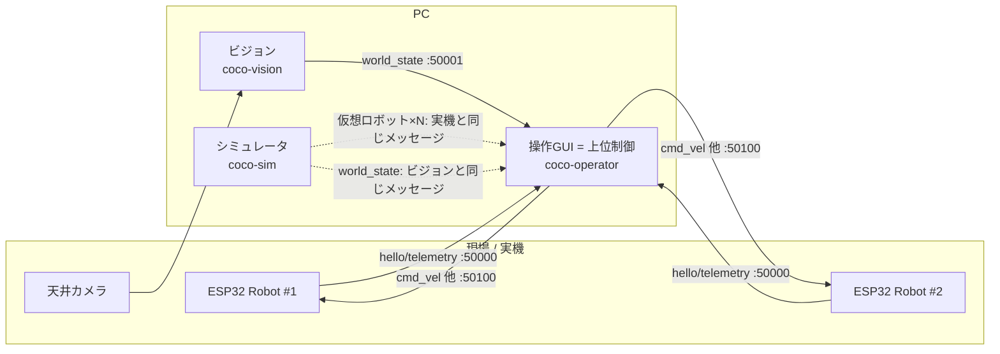
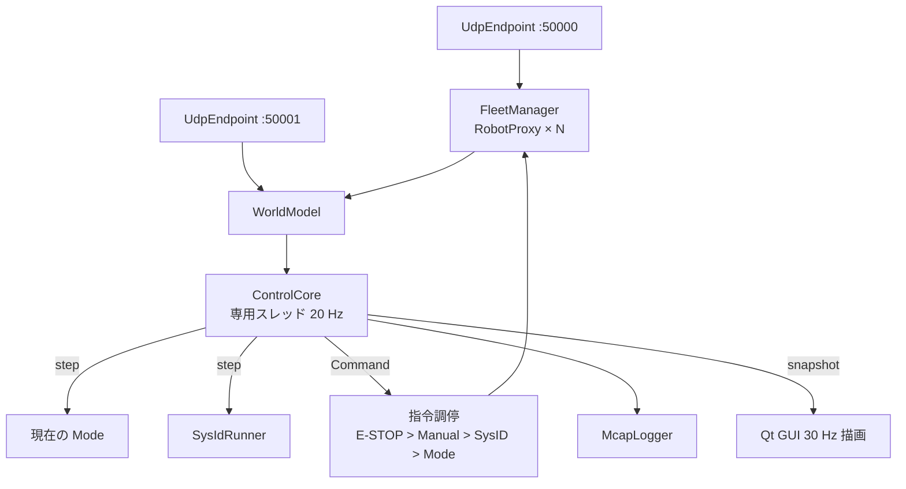

# COCO-LINK アーキテクチャ

## 1. システム全体像

COCO-LINK は **3つの独立したPCプロセス** と **N台の同一構成ロボット** から成る。プロセス間・ロボット間はすべて UDP + JSON（[protocol.md](protocol.md)）でつながる。ROS は使わない。



**設計の核心**: シミュレータは「仮想 ESP32 を N 個」と「仮想ビジョン」を同時に演じる。操作GUIから見ると、実機環境とシミュレータ環境は **ポート番号以外区別がつかない**。したがって、

- 上位制御（モード・同定・ログ）はシミュレータで開発・テストし、そのまま実機で動く
- シミュレータ内の仮想ロボット（`robot/firmware_model.py`）は ESP32 ファームウェアの **参照実装** でもある。ファーム担当者は同じ状態機械・制御則を C++ で書けばよい

## 2. レイヤ構成（`src/coco_link/`）

```
apps/         GUI (PySide6)。ロジックは持たず、下のレイヤを呼ぶだけ
  operator/ simulator/ vision/
─────────────────────────────── ここより下は Qt 非依存（pytest でテスト可能）
modes/        上位制御モード（プラグイン）: idle, manual, formation, follow_person, ...
sysid/        システム同定: 試験シーケンス・推定器・実行ランナ
control/      制御則: 姿勢追従, 経路追従, 隊形生成と割当, 安全(衝突回避)
fleet/        ロボット群の管理: 発見・状態・指令送信, ワールドモデル, ControlCore
sim/          物理シミュレーション, センサモデル, 仮想ロボットノード, ビジョンエミュレータ
vision/       ArUco 追跡, 色領域検出, 床面キャリブレーション, 送信
robot/        ロボットの物理パラメータ, 差動2輪運動学, ファームウェア参照モデル
logging/      MCAP ロガー
net/          UDP エンドポイント（受信スレッド）
protocol/     メッセージ定義 (dataclass) とエンコード
common/       幾何 (Pose2D), 設定ファイル読込, 時刻
```

依存は **上から下への一方向のみ**。`apps` 以外は Qt を import しない。

## 3. 操作GUI（上位制御）の内部



- **ControlCore** は Qt から独立したスレッドで固定周期 (既定 20 Hz) で回る。各周期で
  1. `WorldModel.snapshot()` で最新のビジョン情報＋テレメトリを取得
  2. 有効なコントローラ（Mode / SysIdRunner / Manual）の `step()` を呼んで各ロボットの `Command` を得る
  3. 優先順位で調停し、`FleetManager` 経由で送信
  4. 有効ならすべての入出力を MCAP に記録
- GUI はスナップショットを読むだけで、制御周期に影響しない（GUI が固まってもロボットは安全側に動く）。

### 3.1 モード（プラグイン）

`modes/base.py` の `Mode` を継承し `@register_mode` を付けたクラスを `modes/` に置くだけで GUI のモード一覧に出る。パラメータは `dataclass` で宣言し、GUI が自動でフォームを生成する。詳細は [adding_a_mode.md](adding_a_mode.md)。

## 4. シミュレータの内部

```
SimEngine (固定 200 Hz, Qt 非依存)
 ├─ SimRobot × N : 真の物理パラメータ (個体差) + 差動2輪の剛体運動
 │    └─ FirmwareModel : ESP32 と同じ状態機械・車輪PI・ウォッチドッグ
 ├─ Person / Obstacle / Cargo
 └─ Sensors : 超音波レイキャスト, IMU, AS5600 量子化, 電池放電
VirtualRobotNode × N : UDP 127.0.0.1:(50100+id) で FirmwareModel を公開
VisionEmulator       : 真値にノイズ・遅延を加えて world_state を送信
```

GUI 上でロボットをドラッグすると、その間は運動学が上書きされる（＝人が持ち上げて動かす外乱）。

## 5. ビジョンの内部

```
Camera/VideoFile → ArUco検出 → 床面ホモグラフィ(四隅マーカー ID40–43) → ロボット (x, y, θ)
                 → HSV 色領域 (緑:人 / 赤:障害物 / 青:物資) → 重心を床面へ射影
                 → world_state を operator:50001 へ
```

## 6. スレッドとタイミング

| プロセス | スレッド | 周期 |
|---|---|---|
| operator | Qt メイン（描画） | 30 Hz |
| | ControlCore | 20 Hz（設定可） |
| | UDP 受信 ×2 | イベント駆動 |
| simulator | Qt メイン（描画） | 30–60 Hz |
| | SimEngine | 200 Hz 物理 / 50 Hz テレメトリ / 30 Hz ビジョン |
| vision | Qt メイン | カメラフレームレート |

## 7. 設定ファイル

| ファイル | 内容 |
|---|---|
| `config/network.yaml` | ポート、ホスト |
| `config/field.yaml` | フィールド寸法、四隅マーカーID、色閾値 |
| `config/robots/default.yaml` | ロボット物理パラメータの公称値 |
| `config/robots/robot_XX.yaml` | 個体ごとのシステム同定結果（あれば default を上書き） |
| `scenarios/*.yaml` | シミュレータの初期配置 |
