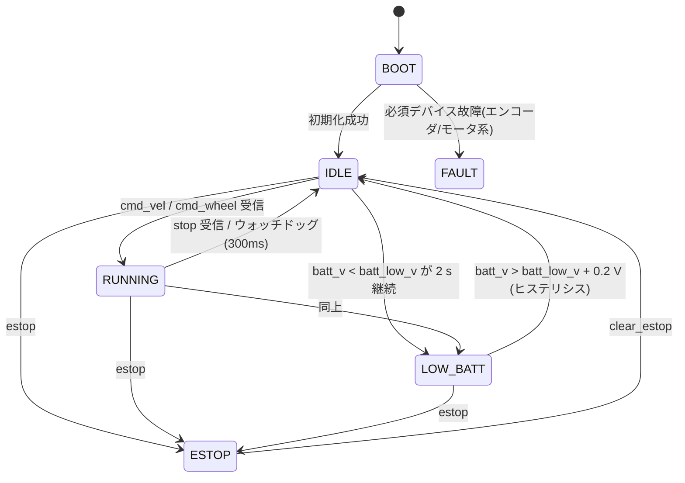

# COCO-LINK ロボット ファームウェア仕様書（ESP32）

| 項目 | 内容 |
|---|---|
| 対象 | COCO-LINK 移動ロボット（全台同一構成） |
| 版 | v1.0（プロトコル v1 対応） |
| 参照実装 | `pc/src/coco_link/robot/firmware_model.py`（シミュレータで動く Python 版。状態機械・制御則は本書と同一） |
| 通信仕様 | [protocol.md](protocol.md) |

本書は ESP32 ファームウェアを実装する人が **これだけ読めば作れる** ことを目標に書かれている。未定事項は **【TBD】** と記す。

---

## 1. ハードウェア構成

### 1.1 構成要素

| 機能 | 部品（候補） | インタフェース | 備考 |
|---|---|---|---|
| マイコン | ESP32 系（ESP32-DevKitC / ESP32-S3-DevKitC など）【TBD】 | – | Wi-Fi 2.4 GHz |
| 駆動 | DC ギヤードモータ ×2（N20 等）【TBD】 | – | 2輪 + キャスタ |
| モータドライバ | DRV8835 / TB6612FNG 等の低電圧対応品【TBD】 | PWM ×4 | 電源が 4.8 V 程度なので低電圧で動くものを選ぶ |
| エンコーダ | AS5600 ×2（磁気式 12bit 絶対角） | I2C | **I2C アドレスが 0x36 固定**（後述） |
| IMU | MPU6050 | I2C (0x68) | 3軸加速度 + 3軸ジャイロ |
| 距離センサ | 超音波 ×2（前・後）HC-SR04 / HC-SR04P / RCWL-1601 | GPIO (Trig/Echo) | HC-SR04 は 5V 品。Echo を 3.3 V に分圧すること |
| LED | フルカラーLED【TBD】 | WS2812B(1線) または RGB PWM(3線) | §6.4 の抽象化で両対応 |
| ブザー | 圧電ブザー（パッシブ） | PWM (LEDC) | |
| 電源 | 単3 or 単4 NiMH ×4（公称 4.8 V）【TBD】 | – | 3.3 V は LDO（低ドロップ品）で生成 |
| 電圧監視 | 分圧抵抗 R1/R2 | ADC | 例: R1 = R2 = 100 kΩ → 比 2.0 |

### 1.2 ハードウェア上の注意（設計レビュー観点）

1. **AS5600 は2個とも I2C アドレス 0x36 固定**。次のどちらかで解決する。
   - (推奨) ESP32 の I2C コントローラ2系統を使う: `Wire`(左エンコーダ + MPU6050)、`Wire1`(右エンコーダ)
   - I2C マルチプレクサ TCA9548A を使う
2. **ADC2 は Wi-Fi 使用中に使えない**。電池電圧は必ず **ADC1** のピンで読む。
3. ESP32 の ADC は非線形なので `analogReadMilliVolts()`（eFuse 校正値を使う）で読む。
4. HC-SR04 の Echo は 5 V 出力。3.3 V に分圧（例 1 kΩ/2 kΩ）するか 3.3 V 動作品を使う。
5. NiMH 4本は満充電 ≈ 5.6 V、放電終止 ≈ 4.0 V。モータ電源とロジック電源はノイズ対策としてコンデンサで分離する。
6. 起動時ストラッピングピン（ESP32: GPIO 0, 2, 5, 12, 15）にはモータや LED を繋がない。

### 1.3 ピン割り当て（ESP32-DevKitC 例）【TBD: 基板設計時に確定】

| 信号 | GPIO | 備考 |
|---|---|---|
| MOTOR_L_IN1 / IN2 | 25 / 26 | LEDC PWM 20 kHz |
| MOTOR_R_IN1 / IN2 | 27 / 14 | |
| I2C0 SDA / SCL | 21 / 22 | AS5600(左) + MPU6050 |
| I2C1 SDA / SCL | 18 / 19 | AS5600(右) |
| US_FRONT_TRIG / ECHO | 4 / 34 | 34 は入力専用 |
| US_REAR_TRIG / ECHO | 16 / 35 | |
| LED (WS2812B) | 13 | RGB PWM の場合 13/32/33 |
| BUZZER | 23 | LEDC |
| VBAT_ADC | 36 (VP) | ADC1_CH0 |

## 2. ソフトウェア構成

### 2.1 開発環境

- PlatformIO + Arduino-ESP32（core 2.x / 3.x）
- ライブラリ: `ArduinoJson` (v7), `Adafruit NeoPixel` または `FastLED`（WS2812B の場合）
- 置き場所: `firmware/`（PlatformIO プロジェクト）

### 2.2 モジュール構成（推奨）

```
firmware/src/
  main.cpp           setup()/loop(), タスク起動
  config.h           ピン定義, 定数
  params.{h,cpp}     パラメータ (NVS: Preferences) — §8
  comm.{h,cpp}       Wi-Fi, UDP 送受信, JSON エンコード/デコード — §7
  state.{h,cpp}      状態機械 — §4
  motor.{h,cpp}      PWM 出力, 方向反転
  encoder.{h,cpp}    AS5600 読み取り, unwrap, 角速度推定 — §5.1
  wheel_ctrl.{h,cpp} 車輪速度 PI + FF + 不感帯補償 — §5.3
  imu.{h,cpp}        MPU6050
  ultrasonic.{h,cpp} 割り込み式エコー計測 — §6.1
  battery.{h,cpp}    電圧計測 — §6.3
  led.{h,cpp}        LED 抽象化・パターン — §6.4
  buzzer.{h,cpp}     トーン・メロディ — §6.5
```

### 2.3 FreeRTOS タスク

| タスク | 周期 | 優先度 | コア | 内容 |
|---|---|---|---|---|
| `ctrl_task` | **100 Hz** (10 ms, `vTaskDelayUntil`) | 高 (5) | 1 | エンコーダ読取 → 速度推定 → 車輪PI → PWM、ウォッチドッグ判定、IMU 読取 |
| `comm_rx_task` | イベント駆動 | 中 (4) | 0 | UDP 受信 → JSON 解析 → 指令キュー/共有変数へ |
| `telem_task` | 50 Hz | 中 (3) | 0 | telemetry 送信、1 Hz で hello |
| `sensor_task` | 50 Hz | 中 (3) | 1 | 超音波トリガ（前後交互）、電池電圧 |
| `ui_task` | 50 Hz | 低 (1) | 0 | LED パターン、ブザー |

共有データは `portMUX`/mutex で保護するか、単一書き込み者の構造体をダブルバッファで渡す。`ctrl_task` 内でブロッキング処理（`delay`, `pulseIn`, `Serial.print` の多用）を **しない**。

## 3. 起動シーケンス

1. シリアル 115200 bps 初期化、パラメータ読込（NVS、無ければ既定値）
2. 周辺初期化（I2C ×2, MPU6050, AS5600 ×2, PWM, ADC, LED, ブザー）。失敗したデバイスは `faults` に記録
3. Wi-Fi STA 接続（SSID/パスワードは NVS。§9 のシリアルコマンドで設定）。`WiFi.setSleep(false)`（省電力を切り遅延を減らす）
4. UDP ソケットを `50100` で開く
5. ブザー `startup` メロディ、状態 → IDLE（必須デバイスに故障があれば FAULT）

## 4. 状態機械



| 状態 | モータ | 受理する指令 | LED（operator の set_led より優先） |
|---|---|---|---|
| BOOT | 停止 | なし | 白 点灯 |
| IDLE | 停止（PI 積分リセット） | すべて | operator 指定（既定: 緑 breath） |
| RUNNING | 指令に従う | すべて | operator 指定 |
| ESTOP | **即時 duty 0**（減速制限なし） | `clear_estop`, `ping`, `get_params`, LED/ブザー以外は無視 | 赤 速い点滅 |
| LOW_BATT | 停止 | `ping`, `get_params`, `estop` | 橙 点滅 + 30 s ごとに警告音 |
| FAULT | 停止 | `ping`, `get_params`, `set_param` | 紫 点灯 |

- **ウォッチドッグ**: 最後の `cmd_vel`/`cmd_wheel` 受信から `watchdog_ms` 経過で目標 0・状態 IDLE。
- ESTOP 中に届いた `cmd_vel` は無視し、状態を変えない。

## 5. 走行制御

### 5.1 エンコーダ（AS5600）

- レジスタ `RAW ANGLE` (0x0C–0x0D) の 12bit 値 `raw ∈ [0, 4095]` を 100 Hz で読む。
- **unwrap**: `d = raw - raw_prev` を `[-2048, 2047]` に折り返して累積 `count += d`。
- 角度 `θ = enc_dir * count * 2π / 4096` [rad]（前進方向が正）。
- 角速度推定: `ω_raw = (θ - θ_prev) / Δt`、一次ローパス `ω = ω + α (ω_raw - ω)`、`α = 0.3`（≒ 時定数 23 ms）。
  - 分解能 2π/4096 ≈ 1.5 mrad、100 Hz では ω の量子化が約 0.15 rad/s あることを理解しておく。
- Δt は `esp_timer_get_time()` の実測値を使う（周期の揺らぎを補正）。

### 5.2 機体速度 → 車輪速度（逆運動学）

`r = wheel_radius`, `b = tread` として

```
ω_L* = (vx - wz * b / 2) / r
ω_R* = (vx + wz * b / 2) / r
```

1. `vx` を `±max_v`、`wz` を `±max_w` にクランプ
2. どちらかの車輪が `ω_max = max_v / r` を超える場合、**両輪を同じ比率で縮小**（旋回半径を保つ）
3. 目標値の変化率を `accel_limit / r` [rad/s²] で制限

### 5.3 車輪速度制御（左右独立）

モータを一次遅れ $\tau\dot\omega + \omega = K u$ とみなし、**モデルの逆系によるフィードフォワード + PI フィードバック**（2自由度制御）で制御する。

```
dω*   = (ω* - ω*_prev) / Δt                 (§5.2 の加速度制限後の目標の変化率)
r_f   = r_f + α (ω* - r_f)                  (目標値にも §5.1 と同じローパス α を通す)
e     = r_f - ω                             (遅れを揃えた偏差)
I     = I + ki * e * Δt                     (アンチワインドアップ: 出力飽和中は積分しない)
u_ff  = kff * (ω* + tau_ff * dω*)           (逆系: u = (ω + τ dω/dt) / K)
u_dz  = sign(ω*) * u_deadzone               (|ω*| < 0.05 rad/s のときは 0)
u     = u_ff + u_dz + kp * e + I
u     = u * batt_nominal_v / batt_v         (電池電圧補償)
u     = clamp(u, -1, 1)
```

- `|ω*| < 0.05` かつ `|ω| < 0.2` のときは `u = 0`、`I = 0`, `r_f = 0`（停止時のうなり防止）。
- **目標値フィルタ `r_f` の理由**: 速度推定 ω はローパスにより約 23 ms 遅れる。生の ω* と比べると加速中に偽の偏差が生じ、
  PI が押し過ぎてオーバーシュートする（シミュレータで約 15 % → 3 % に改善することを確認済み）。
- **`cmd_wheel` 受信中は PI を通さず** `u = left/right` をそのまま出す（電圧補償もしない）。同定はこの開ループ応答を使う。
- ゲインの決め方は [system_identification.md](system_identification.md) を参照（同定した K, τ から IMC 法で kp, ki を、
  `kff = 1/K`, `tau_ff = τ` を算出し `set_param` で書き込む）。

### 5.4 モータ出力

- LEDC 20 kHz、分解能 10 bit。`u > 0` で IN1 = PWM, IN2 = LOW（ドライバの方式に合わせる）。
- `motor_dir_*` で回転方向を反転。

## 6. センサ・アクチュエータ

### 6.1 超音波距離センサ

- 前後を **交互に** 20 ms ごとにトリガ（相互干渉防止）→ 各 25 Hz。
- Echo はピン変化割り込みで立ち上がり/立ち下がり時刻を `esp_timer_get_time()` で記録（`pulseIn` 禁止）。
- 距離 `d = t_echo[s] * 343 / 2`。12 ms 以内にエコーが無ければ `null`（≒ 2 m 以上）。
- 直近 3 サンプルのメディアンフィルタ。

### 6.2 IMU（MPU6050）

- 設定: ジャイロ ±500 dps, 加速度 ±4 g, DLPF 42 Hz, サンプル 100 Hz（`ctrl_task` 内で読む）
- telemetry はロボット座標系（x 前, y 左, z 上）に軸変換した **生値**（バイアス補正は PC 側が同定値で行う）。

### 6.3 電池電圧

- ADC1 ピンを `analogReadMilliVolts()` で 50 Hz 読み、16 サンプル移動平均。
- `batt_v = mV / 1000 * batt_div_ratio`

### 6.4 LED

- `led_set(r, g, b)` を共通APIとし、WS2812B / RGB PWM の実装を `config.h` のマクロで切替。
- パターン: `solid`, `blink`（50% デューティ, `period_ms`）, `breath`（正弦波輝度）, `rainbow`（色相回転）。
- 状態による強制表示は §4 の表に従う。

### 6.5 ブザー

- LEDC の別チャネルで `freq_hz` の矩形波、`dur_ms` 後に停止（ノンブロッキング）。
- メロディ（音階, ms）:
  - `startup`: C5 100, E5 100, G5 150
  - `ok`: G5 80, C6 120
  - `error`: C4 200, 休 50, C4 200
  - `chime`: E5 150, C5 300

## 7. 通信

- プロトコル詳細は [protocol.md](protocol.md)。
- `WiFiUDP` で 50100 番を listen。受信ごとに `JsonDocument` で解析、`v != 1` は破棄。
- 送信元 `(IP, port)` を operator アドレスとして記憶（§2.1 of protocol）。
- `hello` は 1 Hz で `operator_host`（既定 255.255.255.255）:50000 へ。
- `telemetry` は operator 確定後 `telemetry_hz` で送信。1 メッセージ ≈ 400 byte。
- `seq` は送信ごとに +1。`t_ms` は `millis()`。
- **`telemetry` の `t_ms` は、含まれるエンコーダ値・IMU 値を取得した制御周期の時刻とする**（送信時刻ではない）。
  システム同定はこの時刻で微分・積分を行うため、Wi-Fi の遅延揺らぎの影響を受けなくなる。
- 解析に失敗したパケットは黙って捨てる（`log` で通知してもよい）。

## 8. パラメータ（NVS）

- `Preferences` 名前空間 `"coco"` に保存。キーは [protocol.md §7](protocol.md#7-パラメータキー一覧set_param--params) と同じ。
- `set_param` 受信時は値域チェック → RAM 反映 → NVS 保存 → `params` 応答。
- 追加の非公開キー: `wifi_ssid`, `wifi_pass`, `operator_host`（シリアルからのみ設定）。

## 9. シリアルコンソール（115200 bps）

| コマンド | 動作 |
|---|---|
| `id <n>` | robot_id 設定 |
| `wifi <ssid> <pass>` | Wi-Fi 設定 |
| `host <ip>` | operator_host 設定 |
| `param <key> <value>` | パラメータ設定 |
| `show` | 全設定と状態表示 |
| `test motor` / `test us` / `test imu` / `test led` / `test buzzer` | 単体動作試験 |
| `reboot` | 再起動 |

## 10. 受入試験チェックリスト

実装完了時、以下をすべて確認する（操作GUIの「ロボット一覧」「テレオペ」で確認できる）。

- [ ] 電源投入後 2 秒以内に `startup` 音が鳴り、操作GUIの一覧に表示される
- [ ] `telemetry` が 50 Hz ± 5 Hz で届く（操作GUIで受信レート表示）
- [ ] `loop_dt_us` が 10000 ± 500 µs に収まる
- [ ] 車輪を手で前進方向に回すと `enc.left_rad` / `right_rad` が増加する
- [ ] ロボットを左旋回させると `imu.gz` が正になる
- [ ] 前方に手をかざすと `us_front_m` が変化する（後方も同様）
- [ ] テスターで測った電池電圧と `batt_v` の差が 0.1 V 以内
- [ ] テレオペで前進・後退・左右旋回が指令通りの向きに動く
- [ ] 操作GUIを強制終了すると 300 ms 以内に停止する（ウォッチドッグ）
- [ ] `estop` で即停止し、`clear_estop` まで動かない
- [ ] LED 色・パターン、ブザーが指令通りに出る
- [ ] システム同定（操作GUI）がすべて完走する

## 11. 参照実装との対応

| 本書 | `firmware_model.py` |
|---|---|
| §4 状態機械 | `FirmwareModel.state`, `_update_state()` |
| §5.2 逆運動学 | `kinematics.body_to_wheel()`, `limit_wheel_speeds()` |
| §5.3 車輪 PI | `WheelController.update()` |
| ウォッチドッグ | `FirmwareModel.tick()` |
| メッセージ処理 | `FirmwareModel.handle_message()` |

迷ったら Python 版の挙動を正とし、差異を見つけたら本書と Python 版の両方を直すこと。
